# Library Management System – Code Challenge

This project is a Full Stack application that implements a Library Management System. It was developed as part of a technical code challenge.

---

## 🚀 Links

- **Live Demo**: [https://d21meifd8clvjr.cloudfront.net](https://d21meifd8clvjr.cloudfront.net)
- **Live API Docs (Swagger)**: [https://d21meifd8clvjr.cloudfront.net/api/swagger](https://d21meifd8clvjr.cloudfront.net/api/swagger)

---

## 📐 Architecture

The solution is designed for deployment on AWS. It consists of a frontend built with Vue and TypeScript, and a backend developed in Go with the Gin framework. Data is stored in a PostgreSQL database. The backend API is served in a serverless mode. Infrastracture as Code is implemented using Terraform.

The following diagram illustrates the main components and their distribution across AWS services:

```mermaid
%%{init: {"theme": "neutral", 

  "flowchart": {
    "nodeSpacing": 50
  },
"themeVariables": {
  "primaryColor": "#ffffff",
  "edgeLabelBackground": "#ffffff",
  "primaryTextColor": "#1f2937",
  "primaryBorderColor": "#444444",
  "lineColor": "#3b82f6",
  
  "fontFamily": "Segoe UI, sans-serif",
  "fontSize": "18px",
  "spacing": 90
}}}%%

flowchart LR
    subgraph CLIENT["Client"]
        User["🌐 Browser"]
    end

    subgraph CDN["CloudFront"]
        CF["🌍 Distribution"]
    end

    subgraph FRONTEND["S3 (Static Site)"]
        S3["🧑‍💻 Frontend (Vue)"]
    end

    subgraph API["API Gateway"]
        APIGW["🧩 API"]
    end

    subgraph VPC["VPC"]
        subgraph LAMBDA["Lambda"]
            Lambda["⚙️ Backend (Go)"]
        end

        subgraph RDS["RDS"]
            DB["🗄️ PostgreSQL"]
        end
    end

    User --> CF
    CF -->|/api/*| APIGW
    CF -->|static| S3
    APIGW --> Lambda
    Lambda --> DB
```

---

## ☁️ AWS Components

| Service          | Purpose                                    | Security Notes                                          |
|------------------|--------------------------------------------|---------------------------------------------------------|
| Lambda           | Executes the API backend logic             | Deployed inside a VPC for DB access                     |
| RDS (PostgreSQL) | Persistent book and history storage        | Not publicly accessible; accessed only from Lambda      |
| API Gateway      | Exposes the HTTP API                       | Integrated with Lambda using AWS_PROXY                  |
| S3               | Hosts the static frontend files (SPA)      | Public access blocked; served via CloudFront only       |
| CloudFront       | Serves frontend and proxies `/api/*` calls | Uses OAC to securely access S3                          |

---

## ⚙️ Backend Code Guide

| File/Folder                            | Description                                                                                                                                                                                                                                                                                                                                                                                                   |
|----------------------------------------|---------------------------------------------------------------------------------------------------------------------------------------------------------------------------------------------------------------------------------------------------------------------------------------------------------------------------------------------------------------------------------------------------------------|
| `cmd/api/main.go`                      | Application entry point. Starts the Gin router that serves the API, using the AWS Lambda GO API Proxy library to adapt AWS SDK requests to Gin.                                                                                                                                                                                                                                                               |
| `docs/`                                | Folder created after building the project. Contains the Swagger documentation.                                                                                                                                                                                                                                                                                                                                |
| `internal/config/`                     | Contains the configuration components.                                                                                                                                                                                                                                                                                                                                                                        |
| `internal/config/db.go`                | Provides the database connection. Initializes the client using the SQLX library. Retrieves connection parameters from environment variables passed by AWS Lambda. Creates tables and indexes if they don’t already exist.                                                                                                                                                                                     |
| `internal/config/dependencies/`        | Centralizes the creation of components across different layers and is responsible for injecting their dependencies.                                                                                                                                                                                                                                                                                           |
| `internal/config/logger.go`            | Sets up a logger using the ZAP library.                                                                                                                                                                                                                                                                                                                                                                       |
| `database/`                            | Contains components related to database access.                                                                                                                                                                                                                                                                                                                                                               |
| `database/transaction.go`              | Helper that provides functions to wrap business logic in an SQL transaction, handling commit and rollback.                                                                                                                                                                                                                                                                                                    |
| `handlers/`                            | Contains the Gin handlers.                                                                                                                                                                                                                                                                                                                                                                                    |
| `handlers/book_handler.go`             | Book Handler. Implements specific handling for known errors to return the appropriate status code. Includes method comments used to generate Swagger documentation.                                                                                                                                                                                                                                           |
| `handlers/book_handler_test.go`        | Test suite for the Book Handler. These are HTTP tests that cover everything from Gin routing to handler logic. The service layer is mocked.                                                                                                                                                                                                                                                                   |
| `models/`                              | Contains the application models.                                                                                                                                                                                                                                                                                                                                                                              |
| `models/book.go`                       | Defines the models for the Book entity, including both persistence models and the DTOs used for incoming and outgoing API data.                                                                                                                                                                                                                                                                               |
| `models/book_mapper.go`                | Mapper for the Book entity, which converts persistence models to the corresponding DTOs.                                                                                                                                                                                                                                                                                                                      |
| `models/common.go`                     | Defines generic API DTOs (e.g., for errors and confirmation messages).                                                                                                                                                                                                                                                                                                                                        |
| `repositories/`                        | Contains the repositories that implement the various database queries.                                                                                                                                                                                                                                                                                                                                        |
| `repositories/book_repository.go`      | Repository for the Book entity. Implements a classic SQL-based CRUD with logical delete. Provides a List operation that builds the query dynamically based on the given filters. Returns specific errors that require differentiated handling.                                                                                                                                                                |
| `repositories/book_repository_test.go` | Test suite for the Book Repository. Uses the DATA-DOG/go-sqlmock library to mock SQL driver behavior for various queries.                                                                                                                                                                                                                                                                                     |
| `routes/`                              | Contains the components related with Gin routing.                                                                                                                                                                                                                                                                                                                                                             |
| `routes/book_routes.go`                | Registers the routes for the Book entity, mapping each to the corresponding Handler operation.                                                                                                                                                                                                                                                                                                                |
| `routes/router.go`                     | Configures the Gin router. Registers the business routes (in this case, only for Books) and a handler for 404 errors. Receives an environment variable from AWS Lambda that identifies the stage, and in the dev stage, enables Swagger and a CORS middleware to allow testing a local frontend against the API deployed on AWS. It's designed so that Swagger and CORS are disabled in non-dev environments. |
| `services/`                            | Contains the services that implement business logic.                                                                                                                                                                                                                                                                                                                                                          |
| `services/book_service.go`             | Service for the Book entity. Interacts with the Repository for persistence operations. Includes a specific transactional case where two Repository calls are executed atomically.                                                                                                                                                                                                                             |
| `services/book_service_test.go`        | Test suite for the Book Service. This layer includes classic unit tests for operations that involve more than simple pass-through logic.                                                                                                                                                                                                                                                                      |
| `utils/`                               | Contains generic helpers.                                                                                                                                                                                                                                                                                                                                                                                     |
| `utils/errors.go`                      | Defines specific API errors to allow differentiated status code handling in the Handlers layer.                                                                                                                                                                                                                                                                                                               |
| `utils/sql_helpers.go`                 | Defines helper functions for implementing SQL operations.                                                                                                                                                                                                                                                                                                                                                     |
| `test/`                                | Contains HTTP request suites that allow invoking API functionalities from the IDE with a single click.                                                                                                                                                                                                                                                                                                        |
| `test/book_api.http`                   | Set of requests for the Book resource. At the beginning of the file, the base URL of the target environment must be defined, along with the ID for operations on a specific Book.                                                                                                                                                                                                                             |

---

## 🧑‍💻 Frontend Code Guide

| File/Folder                              | Description                                                                                                                                                                                                                                                                                                                         |
|------------------------------------------|-------------------------------------------------------------------------------------------------------------------------------------------------------------------------------------------------------------------------------------------------------------------------------------------------------------------------------------|
| `src/components/base/`                   | Contains generic UI components.                                                                                                                                                                                                                                                                                                     |
| `src/components/base/BaseBadge.vue`      | Generic tag component for displaying a status or any other data with color styling. Takes text and variant as props, each variant having an associated style. The text can be replaced with any other content using a slot.                                                                                                         |
| `src/components/base/BaseButton.vue`     | Generic, customizable button. Accepts a variant prop to choose between different button types, each with its own style. Like the BaseBadge, it can receive any content inside via a slot, such as text or icons.                                                                                                                    |
| `src/components/base/BaseDialog.vue`     | Generic popup-style dialog message. Receives props for title, message, type (confirmation or error), and button texts. Emits events to indicate which button was pressed. Useful for displaying messages or requesting action confirmation.                                                                                         |
| `src/components/books/`                  | Contains specific components for building the book management pages.                                                                                                                                                                                                                                                                |
| `src/components/books/BookFilter.vue`    | Filter section of the book list page. Emits events when the search, add book, or reset filter buttons are clicked.                                                                                                                                                                                                                  |
| `src/components/books/BookForm.vue`      | Book maintenance form. Supports new, edit, and view modes. The view mode is read-only and displays the book's activity history below its details. Includes a button to toggle between edit and view modes. Emits events to notify the parent page of user actions.                                                                  |
| `src/components/books/BookHistory.vue`   | Section that displays the status change history of a book, from most recent to oldest.                                                                                                                                                                                                                                              |
| `src/components/books/BookTable.vue`     | Search result table for books. Includes pagination controls handled by the backend, as well as column sorting also managed server-side. Displays action buttons for each book, separating loan status actions from maintenance (CRUD) actions. It emits events so the parent page managing the list can handle the required action. |
| `src/composables/`                       | Holds reusable logic functions using Vue's Composition API. Note: This app uses the Options API, but includes a composable to simplify popup handling.                                                                                                                                                                              |
| `src/composables/useDialog.ts`           | Allows embedding BaseDialog in any component and showing it programmatically.                                                                                                                                                                                                                                                       |
| `src/layout/`                            | Contains layout components that define the page structure.                                                                                                                                                                                                                                                                          |
| `src/layout/AppHeader.vue`               | Represents the page header. On mobile, it shows a hamburger button to open the sidebar menu.                                                                                                                                                                                                                                        |
| `src/layout/AppLayout.vue`               | Main layout component of the frontend. It arranges the header, menu, and main content section, which changes via Vue Router.                                                                                                                                                                                                        |
| `src/layout/AppSidebar.vue`              | Implements the sidebar menu. On mobile, it can slide in and out with an animation.                                                                                                                                                                                                                                                  |
| `src/pages/`                             | Contains components that represent full pages.                                                                                                                                                                                                                                                                                      |
| `src/BookFormPage.vue`                   | Book form page. Includes the form component and the change history component. Handles mode logic (new/edit/view) and executes actions against the backend.                                                                                                                                                                          |
| `src/BookListPage.vue`                   | Book list page. Includes the filter and result table components. Connects all button actions to API calls. Synchronizes filters and sort criteria with the URL query params, so when navigating back from editing or viewing a book, the list restores its previous page, filters, and sort state.                                  |
| `src/router/index.ts`                    | Defines the Vue Router configuration, registering the route for each page.                                                                                                                                                                                                                                                          |
| `src/services/`                          | Contains functions to call the various backend API endpoints.                                                                                                                                                                                                                                                                       |
| `src/services/bookService.ts`            | Provides access to all Book API features. Uses Axios for HTTP calls and reads the backend URL from the VITE_API_BASE_URL property in the root .env file.                                                                                                                                                                            |
| `src/types/`                             | Contains TypeScript types needed to call the backend API through the services.                                                                                                                                                                                                                                                      |
| `src/types/book.ts`                      | Contains the types needed for using the Books API. They directly match the DTOs from the models package in the Go backend.                                                                                                                                                                                                          |
| `src/utils/`                             | Contains miscellaneous utilities.                                                                                                                                                                                                                                                                                                   |
| `src/utils/bookStatus.ts`                | Provides mappings related to a book’s status. Converts the API status enum into UI-friendly values like status names or variants for BaseBadge.                                                                                                                                                                                     |
| `src/App.vue`                            | Main Vue component. Includes the AppLayout component.                                                                                                                                                                                                                                                                               |
| `src/main.ts`                            | Initializes the Vue app and mounts it to the DOM.                                                                                                                                                                                                                                                                                   |
| `src/style.css`                          | Global stylesheet for the app. Styles are complemented by locally scoped styles in each Vue component.                                                                                                                                                                                                                              |
| `index.html`                             | Provides the base HTML structure and the mount point for the Vue app                                                                                                                                                                                                                                                                |

---

## 🏗️ Infrastructure Code Guide

| File/Folder                | Description                                                                                                                                                                                                                    |
|----------------------------|--------------------------------------------------------------------------------------------------------------------------------------------------------------------------------------------------------------------------------|
| `apigateway.tf`            | Defines the API Gateway resources. Configures the route in proxy+ mode so that a single Lambda function can handle all API requests.                                                                                           |
| `cloudfront.tf`            | Defines the CloudFront Distribution as the access point. Creates an API Gateway origin for the backend assigned to the /api/* path, and an S3 origin for the frontend assigned as the default (everything not targeting the API). |
| `iam.tf`                   | Defines the IAM roles and their permissions.                                                                                                                                                                                   |
| `lambda.tf`                | Defines the main Lambda function that implements the API in Go. Sets the required environment variables for its operation. Configured within the same VPC as the database.                                                     |
| `locals.tf`                | Declares local values, such as the calculated name prefix used in all resources.                                                                                                                                               |
| `main.tf`                  | Main Terraform configuration entry point.                                                                                                                                                                                      |
| `outputs.tf`               | Defines the values printed to the log after the resources are created. The most important is the public CloudFront URL where the application becomes accessible.                                                               |
| `provider.tf`              | AWS provider configurations.                                                                                                                                                                                                   |
| `rds.tf`                   | Declares the PostgreSQL database using RDS. Places it in the same VPC as the Lambda function, with private access only.                                                                                                        |
| `s3.tf`                    | Defines the application's PostgreSQL database. Configured within the same VPC as the Lambda function.                                                                                                                          |
| `terraform.tfvars.example` | Example file to guide the creation of a `terraform.tfvars` file with all required variable values.                                                                                                                             |
| `variables.tf`             | Declares input variables such as project_name, database credentials, and region.                                                                                                                                               |
| `vpc.tf`                   | Defines the VPC, subnets, and security groups used by RDS and Lambda. Ensures database is not publicly accessible.                                                                                                      |

---

## ⚙️ Build & Deploy

To build and deploy the solution, some development tools must be installed as prerequisites.

Additionally, the infra/terraform.tfvars.example file should be copied to terraform.tfvars, and the desired values assigned to its properties. In particular, the project_name property concatenated with a dash (-) is used as a name prefix for all AWS resources to be created.

Once the properties are configured and the required tools are installed, build and deployment tasks can be executed using the Makefile. The available targets are documented below.

### Prerequisites

- Go (>= 1.20)
- Node.js + npm
- Terraform (>= 1.3)
- AWS CLI configured
- Swag (for Swagger docs)

### Make Targets

| Command               | Description                                                                                                                                |
|-----------------------|--------------------------------------------------------------------------------------------------------------------------------------------|
| `make`                | Alias for `make build`                                                                                                                     |
| `make build`          | Builds both the backend and the frontend.                                                                                                  |
| `make build-backend`  | Builds the backend by compiling the Go application and generating a ZIP file for deployment to AWS Lambda.                                 |
| `make build-frontend` | Builds the Vue frontend using the Vite build tool.                                                                                         |
| `make swagger`        | Generates Swagger documentation from comments in the Go code.                                                                              |
| `make deploy`         | Builds and deploys both the backend and frontend, creating or updating all necessary AWS resources via Terraform.                          |
| `make update-lambda`  | Updates only the backend code in the Lambda function.                                                                                      |
| `make update-site`    | Updates only the frontend code in the S3 bucket and triggers a CloudFront distribution invalidation to remove the previous cached version. |
| `make destroy`        | Destroys all AWS resources created by Terraform for this project.                                                                          |
| `make clean`          | Cleans up the files generated by the backend and frontend build processes.                                                                 |

---

## 📌 Final Considerations

The solution aims to showcase a maintainable code structure for both frontend and backend, incorporating infrastructure as code to simplify resources management.

From a functional perspective, usability was prioritized over code repetition. Book CRUD and Book Status Report requirements were unified into a single listing view, allowing filtered searches, sorting, and pagination—handled by the backend API rather than the browser.

Following the same principle of avoiding repetition in this demonstration, a CRUD for Authors was not included.
